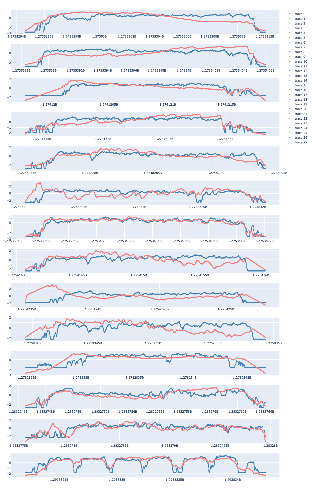
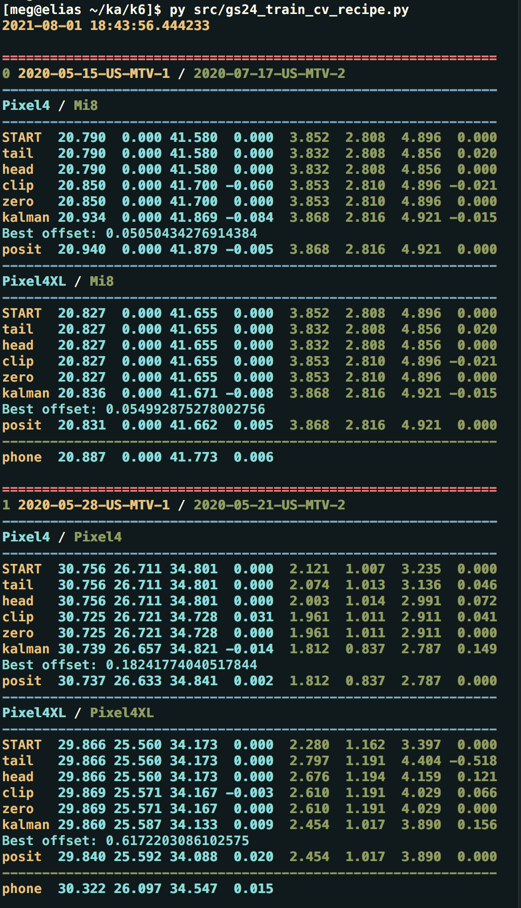

# README

## Google Smartphone Decimeter Challenge

This is the summary of my solution in the kaggle competition "Google
Smartphone Decimeter Challenge". 

[Google Smartphone Decimeter Challenge](https://www.kaggle.com/c/google-smartphone-decimeter-challenge/overview)

The rough sketch of the solution is shown in this README with 
part of the codes are presented as needed. The whole codes are 
in the directory `./src`.

This text was written in August 2021.

### Overview of challenge

The aim of the competition is to find how we can best correct the 
locations of the smartphones that receive the GNSS signals. 
GNSS is the short hand of Global Navigation Satellite System. GPS
(Global Positioning System) is a part of the system that is most often 
used in the US. The European counterpart of the GPS is called Galileo, which 
is partly operational since 2014, and will be in full service this year.

The hardware to receive the GNSS signals from the satellites in space 
had long way of the evolution from a backpack-size receiver in 1970s to 
5mm square chips installed inside the most smartphones in the market today.
The accuracy of the locations that the current smartphones can attain is
about 5m. The goal of this challenge is to improve the accuracy better
than a meter ("decimeter") with a hope that we could even distinguish 
which lane the car is running on a highway for instance.


### Data

Data is provided by the Google Team who collected the GNSS data in various
locations in San Francisco Bay Area. Several smartphones of different
models are set on the dashboard of a car (Pixel4, Pixel4XL, Pixel5,
XiaomiMi8, SamsungS200Ultra, but not all of them in the same time).
Each smartphone records the longitude and the latitude of the car while 
the car is running along the route. The signals from the GNSS are used 
to calculate the current coordinates. The ground truth of the location 
is given by a  larger GNSS receiver system installed on the backseat 
of the car. The large GNSS receiver system has a much better 
accuracy in calculating the current coordinates than GNSS 
chips in the smartphones.

The data offered to the competitors consists of (1) raw NMEA 
data and (2) the baseline locations of the car at every second 
derived from NMEA data by the off-the-shelf GNSS software. 
One can either start from raw data (1) and develop your own GNSS
data reduction tools, or start from (2) and concentrate on 
the data post-processing. My strategy is the latter.


### Characteristics of the data

There are 19 courses in the test dataset. In a directory for 
one particular course, there are multiple directories 
for the different smartphone on the dashboard.  
Each directory hold three files : the baseline coordinate, 
the ground truth, and the NMEA data. 

<!--  -->


The major part of the 19 courses are on the westside of the Bay Area 
on the highways that roughly runs between San Jose and San
Francisco. A few courses, though, run suburbs of San Jose, and three 
are in the downtown San Jose. The accuracy of the coordinates 
are worse (much worse) in the "urban canyons" in the downtown area
compared to the coordinates recorded on the open highways. This 
is because the numbers of available satellites on the sky are 
limited in the downtown by the obscuration by the tall buildings.


## Strategy

The strategy is not to touch the GNSS raw data, but to concentrate on
the post-processing of the baseline. The post-processing is, in large 
part, to clean and reorder the data points along the driving routes, 
using various techniques of filtering and smoothing. The following 
measures are taken for the purpose.  

1) Prepare the correction / filtering / smoothing kits in the form of 
   functions. 

2) Try them one by one to see if they are effective for cleaning.
   The nature of the problem differs depending on the type of roads.
   In the urban canyons, we need aggressive outlier removal and smoothing, 
   while minimum cleansing is necessary on the open highways.
   A wrapper around the functions is written to make it easy and fast to 
   select the effective recipes and to tune the cleaning parameters.


4) Utilities
   + EDA
   + map visualizations
   + fake ground truth data

   The visualisation tools and the roles of the fake ground truth data are 
   discussed below. 

```python

def create_fake_gt(df_test_ex, df_train_gt, dist_snap=48):

    df_fake_gt = df_test_ex.copy()

    for idx_test, d_test in df_test_ex.iterrows():

        latx = d_test['latDeg']
        lngx = d_test['lngDeg']

        n_rep = df_train_gt.shape[0]

        lat = np.repeat(latx, n_rep)
        lng = np.repeat(lngx, n_rep)

        dist = calc_haversine(
            lat, lng, df_train_gt['latDeg'].values, df_train_gt['lngDeg'].values)

        idx = dist.argmin()

        if dist[idx] < dist_snap:

            df_fake_gt.loc[idx_test, 'latDeg'] = df_train_gt.loc[idx, 'latDeg']
            df_fake_gt.loc[idx_test, 'lngDeg'] = df_train_gt.loc[idx, 'lngDeg']

    return df_fake_gt

```

### Visualization

Interactive visualisation (zoom, move, and show additional information 
for a data point) are written using plotly and its Scattermapbox 
function to evaluate the performance of the recipes.


```python

def visualize_before_after(df_before, df_after):

    zoom = 18
    center = dict(lat=df_after.loc[0, 'latDeg'],
                  lon=df_after.loc[0, 'lngDeg'])

    c = df_after['collectionName'].drop_duplicates().values[0]
    p = df_after['phoneName'].drop_duplicates().values[0]

    title_text = c + '  ' + p

    trace_before = go.Scattermapbox(
        lat=df_before['latDeg'],
        lon=df_before['lngDeg'],
        mode='markers',
        opacity=0.6,
        marker=dict(size=14, color='midnightblue'),
        text=df_before[['phoneName', 'millisSinceGpsEpoch']],
        hoverlabel=dict(font=dict(size=20)),
        hoverinfo='text')

    trace_after = go.Scattermapbox(
        lat=df_after['latDeg'],
        lon=df_after['lngDeg'],
        mode='lines',
        text=df_after[['phoneName', 'millisSinceGpsEpoch']],
        hoverlabel=dict(font=dict(size=20)),
        hoverinfo='text')

    data = [trace_before, trace_after]

    layout = go.Layout(hovermode='closest',
                       mapbox=dict(style='stamen-terrain',
                                   center=center,
                                   zoom=zoom),
                       title=dict(text=title_text,
                                  font=dict(size=20)),
                       width=2048, height=2048)

    fig = go.Figure(data=data, layout=layout)
    fig.show()

```

### Fake Ground Truth Data

Among 19 routes in the test dataset, 16 have partly or entirely
overlapping routes in the training dataset. These training datasets 
serve as a template of the ground truth for the test data. The training 
ground truth differs from the test data in the temporal sampling, 
and possibly the driving directions. Nevertheless the fake ground 
truth for the test data are useful for 

- Correcting the measurements of the coordinates that are overlay off 
  the roads on the maps.

- Calculating faked scores for the test dataset to see how good newly-added 
  recipes perform.

```python


def snap_course_off(df_test_ex, df_train_gt, off_crit=12.5):

    for idx_test, d_test in df_test_ex.iterrows():

        latx = d_test['latDeg']
        lngx = d_test['lngDeg']

        n_rep = df_train_gt.shape[0]

        lat = np.repeat(latx, n_rep)
        lng = np.repeat(lngx, n_rep)

        dist = calc_haversine(
            lat, lng,
            df_train_gt['latDeg'].values, df_train_gt['lngDeg'].values)

        idx = dist.argmin()


        if dist[idx] > off_crit:

            df_test_ex.loc[idx_test, 'latDeg'] = df_train_gt.loc[idx, 'latDeg']
            df_test_ex.loc[idx_test, 'lngDeg'] = df_train_gt.loc[idx, 'lngDeg']

    return df_test_ex

```


### IMU (Inertial Measurement Unit) data

IMU records the mechanical movement of the smartphones with 
the accelerometer (=force) and the gyros (= angle of the smartphones with
respect to the 3D space). I tried to use them in two ways:

1. Use these kinetic data to predict the next locations of the cars by machine
   learning technique, specifically, LightGBM, following Alvin.ai's code. 
https://www.kaggle.com/alvinai9603/predict-next-point-with-the-imu-data

The machine learning technique worked well for the urban canyon
data (the most noisy data), but not for others. IMU LightGBM recipe 
is not used in none of the post-processing. 


2. Use the acceleration and the gyro data to calculate the 
   next positions, following museas' code.

https://www.kaggle.com/museas/estimating-the-direction-with-a-magnetic-sensor

The acceleration data are uncalibrated, which means, there are unknown
bias in the force (=acceleration) measured. If the bias is constant,
one can just subtract it, however, the initial EDA shows the bias
(likely a simple additive offset in the force) are variable, and the 
trigger of the jump in the bias was unclear. I could not make use of 
the acceleration data, except for the detection of the status of the car 
if it is in motion or not. 



**Unpredictable bias change. Orange: uncalibrated data, blue: calibrated data in training dataset**


### Recipes

Here the various cleaning recipes are briefly discussed.

1. Removing outlier coordinate with sigma clipping 

The first post-processing is the outlier rejection. The data points 
along the route are compared with the average latitude and the longitude 
of the $n$ neighbouring points, without including the data point in question 
itself. In order not to include the _neighbouring_ outliers, the data points 
to be averaged are sigma clipped beforehand (sigma=1.5. fixed).

In case the datapoint in question (the latitude and the longitude) is off 
from the average of $n$-neighbouring points by a given factor of sigma 
(standard deviation at the averaging), the data point is replaced with the 
the average of the $n$-neighbouring point. The number of neighbours (_n_) 
and the sigma criterion are tunable.

```python

def clip_baseline(df, nn, d_cutoff, inplace=True, abs_dist=False):

    lat_nn = []
    lng_nn = []

    sig = 1.5
    for m in df['millisSinceGpsEpoch']:
        x = np.abs(df['millisSinceGpsEpoch'] - m)
        idx = np.argsort(x)[1:nn]

        latx = df.iloc[idx]['latDeg'].values
        latx, _, _ = sigmaclip(latx, sig, sig)

        lngx = df.iloc[idx]['lngDeg'].values
        lngx, _, _ = sigmaclip(lngx, sig, sig)

        lat_nn.append(np.mean(latx))
        lng_nn.append(np.mean(lngx))

    # -----------------------
    # add new columns
    df['latDeg_nn'] = lat_nn
    df['lngDeg_nn'] = lng_nn

    # from df basline
    diff_lat = df['latDeg'] - df['latDeg_nn']
    diff_lng = df['lngDeg'] - df['lngDeg_nn']

    if abs_dist:

        idx_lat = abs(diff_lat) > d_cutoff
        idx_lng = abs(diff_lng) > d_cutoff

    else:
        idx_lat = abs(diff_lat) > (diff_lat.std() * d_cutoff)
        idx_lng = abs(diff_lng) > (diff_lng.std() * d_cutoff)

    idx_rep = idx_lat + idx_lng

    if inplace == False:

        df['latDeg_clipped'] = df['latDeg']
        df['lngDeg_clipped'] = df['lngDeg']

        # add new columns
        df.loc[idx_rep, 'latDeg_clipped'] = df.loc[idx_rep, 'latDeg_nn']
        df.loc[idx_rep, 'lngDeg_clipped'] = df.loc[idx_rep, 'lngDeg_nn']

    else:
        # override
        df.loc[idx_rep, 'latDeg'] = df.loc[idx_rep, 'latDeg_nn']
        df.loc[idx_rep, 'lngDeg'] = df.loc[idx_rep, 'lngDeg_nn']

    return df

```
2. Kalman filtering

Kalman filtering compares two ways of estimating the true data points you 
are monitoring. The code published by Marcin Bodych is used.

https://www.kaggle.com/emaerthin/demonstration-of-the-kalman-filter

1) Observed data themselves that contains finite errors. 

2) Extrapolating the previously observed data to the current time 
   using the velocity and the acceleration in the past, but without using 
   the current data themselves. 

Sometimes observation noise is large, and it is more advantageous to rely 
on the past records to predict the current data. Other times the observed 
data is simply more accurate than the prediction from the past. The weights, 
on which estimate we trust more, can be adjusted by reducing or incerasing `obevation_noise`.

```python

def apply_kf_smoothing(df, kf_):
    unique_paths = df[['collectionName', 'phoneName']
                      ].drop_duplicates().to_numpy()
#    for collection, phone in tqdm(unique_paths):

    for collection, phone in unique_paths:
        cond = np.logical_and(df['collectionName'] ==
                              collection, df['phoneName'] == phone)
        data = df[cond][['latDeg', 'lngDeg']].to_numpy()
        data = data.reshape(1, len(data), 2)
        smoothed = kf_.smooth(data)
        df.loc[cond, 'latDeg'] = smoothed.states.mean[0, :, 0]
        df.loc[cond, 'lngDeg'] = smoothed.states.mean[0, :, 1]

    return df

T = 1.0

state_transition = np.array([[1, 0, T, 0, 0.5 * T ** 2, 0],
                             [0, 1, 0, T, 0, 0.5 * T ** 2],
                             [0, 0, 1, 0, T, 0],
                             [0, 0, 0, 1, 0, T],
                             [0, 0, 0, 0, 1, 0],
                             [0, 0, 0, 0, 0, 1]])

process_noise = np.diag([1e-5, 1e-5, 5e-6, 5e-6, 1e-6, 1e-6]
                        ) + np.ones((6, 6)) * 1e-9

observation_model = np.array([[1, 0, 0, 0, 0, 0], [0, 1, 0, 0, 0, 0]])
observation_noise = np.diag([5e-5, 5e-5]) + np.ones((2, 2)) * 1e-9

kf = simdkalman.KalmanFilter(
    state_transition=state_transition,
    process_noise=process_noise,
    observation_model=observation_model,
    observation_noise=observation_noise)

cols = ['collectionName', 'phoneName',
        'millisSinceGpsEpoch', 'latDeg', 'lngDeg']

```

3. Savitzky-Golay smoothing
Ad-hoc smoothing. The size of the window and the order of the polynomial 
are tunable. 

4. Spline smoothing

Ad-hoc smoothing. The size of the window and the order of the polynomial 
are tunable.

5. Pin stationary positions

Even when a car is totally stationary, the measured latitude and the longitude 
scatters around the true location of the car, because of the intrinsic errors
in the GNSS data. In order to reduce the scatter, the data points collected 
while the car is not in motion are averaged with sigma-clipping, and are 
replaced with the average.  

Stationary state is detected in two ways.

- Based on the actual positions. If the displacement of the car in the 
latitude and the longitude in pre-fixed times interval (nn) is less 
than a certain criterion (default 12.5m), the car is considered to  
be in the stationary state. 

- Based on the acceleration calculated from the GNSS data by museas' code. 


6. Head-tail cut off

The data collection cars have some clear stationary state before 
starting and the ending of the route as the data collection finished. 
These parts of the coordinates data are cut and replaced with the 
sigma-clipped mean. 


7. Average over phones

Each route in the test dataset consists of the multiple data collected 
by different smartphones. They should have all same ground truth measured 
by the single GNSS device on the backseat of the same car. Therefore, 
the post-processed data from each smartphone on the same route are 
combined together (=resampled and averaged) for the better accuracy. 
In case that the results from each smartphone are with overly different 
quality, the worst performing phones are removed before averaging. 

8. Snap course-off data to fake ground truth

The urban canyon data collected near the San Jose downtown has huge 
scatter with large deviations from the streets. The extent of the 
course-off is particularly large where the street runs through 
tall buildings on both sides. In such cases, fake ground truth are 
created from the training data, and the test data points with the 
deviations larger than a given criterion (default 12.5m) are replaced 
with the faked ground truth.

9. Adaptive Gaussian filtering
See Petr B's code. 

https://www.kaggle.com/bpetrb/adaptive-gauss-phone-mean

10. Overall position shift (3D)

See Wojtek Rosa's code. 
[!Wojtek's code](https://www.kaggle.com/wrrosa/gsdc-position-shift)

The function applies a scalar shift (to be projected to 3D axis) to 
a course in the training data, and optimise that shift using `optuna`
to minimise the deviation from the ground truth. The same scalar shift 
is applied to a test data that shares the course with the training data
either partly or entirely. 


11. Overall position shift (2D)

The function applies 2D shift (the longitude and the latitude) 
to the data points in the test dataset. `optuna` was used to minimize 
the deviation of the dat points from the fake ground truth. 

```python

def apply_position_shift3(df_test_ex, b_train, df_train_gt):

    g_train = df_train_gt.copy()

    study = optuna.create_study()

    study.optimize(lambda trial: objective3(
        trial, b_train, g_train), n_trials=64)

    a_best, b_best = study.best_params['a'], study.best_params['b']
    score = study.best_value


    df = position_shift3(df_test_ex, a_best, b_best)

    df_test_ex['latDeg'] = df['latDeg']
    df_test_ex['lngDeg'] = df['lngDeg']

    return df_test_ex

    # ------------------------------------------------

def objective3(trial, b_train, g_train):
    #    print(zip(b_train['latDeg'], g_train['latDeg']))
    a = trial.suggest_uniform('a', -0.0001, 0.0001)
    b = trial.suggest_uniform('b', -0.0001, 0.0001)

    score, _ = compute_dist3(position_shift3(b_train, a, b), g_train)

    return score

```

12. Conditional offset by motion

The overall position shift is measured and applied to the test data 
depending on the state of the car (stationary or in motion). 
The motion status is evaluated by the position changes or by the IMU acceleration.


## Post-processing was manually tuned

The choices of the recipes to apply, the parameters to hand to the functions, 
and the order of the recipes at the application to the data are manually 
optimized using visualization utilities. Example of tuning:

```python

params_mtv = dict(d_cutoff=2.0,
                  nn=3,
                  n_tail=12,
                  n_head=12,
                  rolling_window=8,
                  dist_crit=12.5,
                  d_crit=0.005,  # stationary criterion in deg
                  n_idle=8,
                  off_crit=12.5,
                  kf_obs_noise=5e-5,
                  n_window=7,
                  n_order=3,
                  phone_mean=[])  # correct course off [m]

recipe_mtv = ['t', 'h', 'c', 'z', 'k', 'p', 'p3'] # recipe

....

for i_recipe in range(n_recipe):
   if recipe[i_recipe] == '-':
         pass

   elif recipe[i_recipe] == 'c':
         df_test_ex, df_train_ex = clip_module(
            df_test_ex, df_train_ex, df_train_gt, d_cutoff, abs_clip, nn)

....

```

The main program is `gs24_train_cv_recipe.py`. The log looks like following. 

<!--  -->


-----------------

## Result

- 3.454 m : mean of 50th and 95th percentile distance error 
- 53rd place, 6.5% in total 810 teams (985 competitors) participated.
- Bronze medal (Solo. No teaming up with other competitors)


